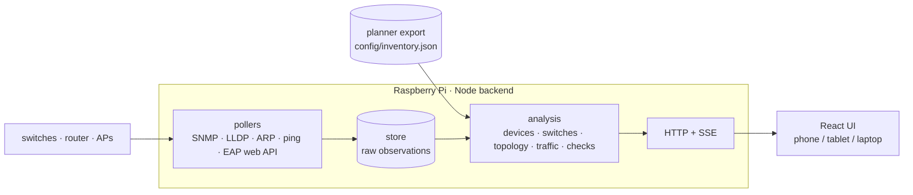

<h1 align="center">
  
  &nbsp;ABOUTUS Network Monitor
</h1>

<p align="center">
  <b>Live dashboard for the ABOUTUS event network</b><br>
  Runs on the Raspberry Pi in the rack · open <a href="http://aboutus-net">http://aboutus-net</a> from any phone, tablet or laptop on the network
</p>

<p align="center">
  <a href="#what-it-shows">Pages</a> ·
  <a href="#how-it-works">How it works</a> ·
  <a href="#what-it-can-measure">Data sources</a> ·
  <a href="#quick-start">Quick start</a> ·
  <a href="#deployment-on-the-pi">Deployment</a> ·
  <a href="#configuration">Configuration</a> ·
  <a href="docs/">Docs</a>
</p>

---

The monitor takes the export of the [Network Config](../about-us-network-config) planner as the **plan**,
discovers the **real** network — switches over SNMP and LLDP, the router's ARP and interface tables,
the access points' own web API, ping sweeps — and shows where the two differ. During a show you see at
a glance what is online, where it is plugged in, which VLAN it is in, who is on which access point, how
much the internet uplink is doing, and whether trunks, APs and uplinks are healthy.

It is built for a technician under time pressure, not for a network engineer with a MIB browser:
every problem says what is wrong, why it matters right now, and what to do about it.

## What it shows

| Page | What you get |
| --- | --- |
| **Overview** | One screen: health, problems, internet with live WAN throughput, infrastructure grouped by type, recent changes. The browser tab icon doubles as a traffic light — and its dot walks around the corners while the page is live. |
| **Problems** | Production checks with severity, the affected device or port, an explanation and a fix: wrong access VLAN, VLAN missing on a trunk, AP trunk mismatch, infrastructure on the wrong port, unreachable or stale infrastructure, failing SNMP, duplicate IP, discards and errors on ports, trunks that lost link, LLDP on access ports, device in the wrong VLAN, the Pi outside the plan, unreadable APs. A trunk that was unplugged on purpose can be *resolved* for the current setup with one confirmed click. |
| **Devices** | Everything on the network: IP (with a one-click link to its web UI), MAC, hostname/vendor, VLAN, where it sits — switch and port, the router port, or the AP with SSID and signal for Wi-Fi devices — and its status. Filters for online / clients / located / unlocated / stale / offline, VLAN, switch, known/unknown; sortable columns. Name, owner, category, notes, favourite/ignore and MAC aliases follow a device across IP and port changes. |
| **Switches & Ports** | Physical port maps in the planner's colours and layouts (odd/even, bottom-up, SFP block). Per port: link, speed, live vs planned VLANs, learned MACs, located devices, LLDP neighbour, traffic and errors. Differences from the plan are marked on the port. |
| **Topology** | Live graph: the internet on top, the router, switches from LLDP, APs and devices from the MAC tables, links animated while they are up, labels with ports and speed, expected-but-missing trunks. Layered automatically; nodes can be dragged. |
| **VLANs** | Planned and discovered VLANs, subnets, gateway reachability, members, and every port carrying the VLAN — highlighted on the port maps of the switches in use. |
| **Traffic** | Internet download/upload measured on the router's WAN interface, everything reaching the router, and per-VLAN throughput (access ports plus Wi-Fi clients on the VLAN's SSIDs) — with history, peaks, a table view and 15 min / 1 h / 3 h ranges. |
| **WLAN** | One card per access point: which device is on it, with SSID, band, signal and connection time; radios, channels, load and firmware underneath. Read straight from standalone Omada EAPs — no controller needed. |
| **Events** | Timeline of joins, leaves, moves, Wi-Fi roaming, link changes, outages, problems raised and cleared — kept across restarts, paged. |
| **Settings** | Setup (which planned devices are in use, new-show reset), polling cadence, thresholds, SNMP communities, discovery sources, inventory upload/sync, access point login, Omada and syslog integrations, export/import. Secrets never leave the Pi. |

Run the [demo](#quick-start) to click through every screen with simulated data — the scenario deliberately contains
an offline switch, a wrong access VLAN, a flapping AP, a duplicate IP, a wandering laptop and more
([docs/screenshots.md](docs/screenshots.md)).

## How it works



- **The plan is the reference, not the truth.** Every difference between the planner export and what
  the switches report becomes a marked port or a problem — never a silent correction.
- **Not every planned device is on every job.** A planned device joins the *setup* the first time it
  answers a ping and is never removed automatically, so an outage stays visible. Devices not in use are
  pinged only, never SNMP-polled, never raise problems and are hidden from the topology and port maps.
  Toggle them in **Settings → Setup**; **Start new setup** forgets what was learned before the next show.
- **The browser never scans anything.** The Pi owns polling, cooldowns, concurrency and history and pushes
  updates over Server-Sent Events. *Refresh* asks the Pi to run its jobs now — the minimum gap between
  runs still applies, so it can never flood the network.
- **Identity is MAC-first.** A MAC is a device; user metadata can merge several MACs; an IP that only
  answers pings becomes an IP-only device. Location comes from LLDP for infrastructure, from the newest
  MAC-table sighting on an edge port for everything else, and from the router's own MAC table or the
  AP's client list when a device is not on a switch port at all.

## What it can measure

| Feature | Source | Needs |
| --- | --- | --- |
| Port maps, link state, counters | IF-MIB | SNMP v2c read community on the switch |
| Live vs planned VLANs | Q-BRIDGE-MIB | Dell N-series, Allied GS950, TP-Link JetStream *(the T1600G exposes no VLAN table — its ports are checked by what they discard)* |
| Where a device is plugged in | switch MAC tables (`dot1qTpFdbPort`), router MAC table | SNMP on the switches; the LANCOM router exposes its bridge table too |
| Topology | LLDP-MIB on the switches, `lldpd` on the Pi | LLDP enabled on the switches |
| IP ↔ MAC in every VLAN | router ARP over SNMP, Pi neighbour table, ping sweeps | router community **or** Pi VLAN sub-interfaces |
| Wi-Fi clients, SSIDs, signal, per-client throughput | standalone Omada EAP web API (the same login as the browser) | the APs' admin login in **Settings → Integrations** — or an Omada controller with an Open API client |
| Internet throughput | router IF-MIB 64-bit counters on the WAN interface (`DSL-1`, `WAN-*`, `PPPoE`, `LTE`, auto-detected) | router community |
| Per-VLAN throughput | sum over the VLAN's access ports plus Wi-Fi clients on its SSIDs | as above; trunks are never attributed to a VLAN |

Everything is pull-based over a few packets per second — see [docs/polling.md](docs/polling.md) for the exact cadence
and cost of every job, and what is deliberately *not* measured.

## Quick start

Development on any machine:

```bash
npm install
npm run dev:demo      # backend on :8080 with a simulated show network + Vite UI on :5174
```

Open http://localhost:5174. `npm run dev` runs the backend against the real network from your machine
instead (`arp -a`/`ping` on macOS, `ip neigh`/`fping` on Linux).

## Deployment on the Pi

```bash
git clone <this repo> ~/about-us-network-monitor
cd ~/about-us-network-monitor
sudo bash deploy/install.sh
```

That installs Node 22, `fping`, `snmp`, `lldpd`, builds the app into `/opt/about-us-network-monitor`
and starts the `aboutus-net-monitor` systemd service on port 80. VLAN sub-interfaces, hostname/DNS and
troubleshooting: [docs/deployment.md](docs/deployment.md).

```bash
sudo systemctl status aboutus-net-monitor
sudo journalctl -u aboutus-net-monitor -f
sudo bash /opt/about-us-network-monitor/deploy/update.sh   # after pulling new code
```

If the Pi already runs the monitor under its own unit from a checkout in the home directory, a deploy is
just `npm run build` followed by a restart of that unit. `index.html` is served uncached and the bundles
are content-hashed, so browsers pick up a new build on the next reload.

## Configuration

Everything lives in **Settings** in the UI and is stored on the Pi in `data/settings.json` (git-ignored;
SNMP communities, AP and controller credentials are masked in the UI and never leave the Pi).

| Variable | Default | Purpose |
| --- | --- | --- |
| `PORT` / `HOST` | `80` / `0.0.0.0` | Where the backend listens |
| `DATA_DIR` | `./data` | Settings, known devices, events, traffic history |
| `INVENTORY_FILE` | `config/inventory.json` | Planner export used until one is uploaded or synced in the UI |
| `MONITOR_MODE` | `live` | `demo` runs the simulated network |
| `LOG_LEVEL` | `info` | `debug` · `info` · `warn` · `error` |

## Commands

| Command | Purpose |
| --- | --- |
| `npm run dev` / `npm run dev:demo` | Backend + UI with hot reload (live / simulated network) |
| `npm run build` | Build the UI (`web/dist`) and the backend bundle (`server/dist/index.js`) |
| `npm start` / `npm run start:demo` | Run the built backend (serves the UI) |
| `npm run check` | Typecheck + lint + tests |
| `npm test` | Unit tests (parsers, port mapping, EAP client, router WAN detection, scheduler) and an end-to-end analysis of the demo network |
| `npm run snmp:probe -- 192.168.99.11 <community>` | Verify an SNMP community and print how a device names its ports |

## Layout

```
config/inventory.json   planned inventory (planner export) — the reference, not the truth
shared/                 API types, MAC/IP helpers, port layout (used by server and web)
server/                 Node backend: pollers, scheduler, analysis, HTTP + SSE
web/                    React UI (Vite, Tailwind, React Flow)
deploy/                 systemd unit, install.sh, update.sh
docs/                   architecture, polling strategy & measurements, deployment, API
data/                   runtime state on the Pi (settings, known devices, events, history) — git-ignored
```

[docs/architecture.md](docs/architecture.md) · [docs/polling.md](docs/polling.md) · [docs/api.md](docs/api.md) · [docs/deployment.md](docs/deployment.md)

---

<p align="center"><sub>Built for and tested against Dell N1524P, Allied Telesis GS950/48, TP-Link T1600G-28TS, a LANCOM 1783VAW and TP-Link EAP650 access points in standalone mode.</sub></p>
